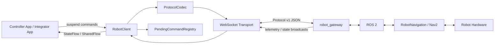

# Robot Controller

<p align="center">
  <strong>Android robot-control platform + reusable Kotlin SDK for ROS 2 / Nav2 robots.</strong>
</p>

<p align="center">
  A modular Jetpack Compose controller application backed by a framework-neutral WebSocket SDK with typed commands, reactive robot state, capability negotiation, reconnection, map lifecycle, missions, diagnostics, discovery, and test tooling.
</p>

<p align="center">
  
  
  
  
</p>

<p align="center">
  
</p>

---

## Engineering Snapshot

| Area | Implementation |
|---|---|
| **Reusable SDK** | Kotlin Android library exposed through `RobotClient` |
| **Transport** | OkHttp WebSocket with optional WSS/TLS hooks |
| **Protocol** | Versioned JSON envelopes using kotlinx.serialization |
| **Robot backend** | `robot_gateway` → ROS 2 → RobotNavigation / Nav2 / hardware |
| **State model** | Kotlin `StateFlow` + `SharedFlow` |
| **Commands** | Suspend APIs with typed `RobotResult<T>` |
| **Reliability** | Heartbeat, latency metrics, stale telemetry detection, bounded exponential reconnect |
| **Control scope** | Navigation, manual velocity, docking, safety, maps, virtual walls, saved locations, missions |
| **Multi-robot** | `RobotManager` manages independent clients by robot ID |
| **Discovery** | UDP discovery beacon flow |
| **Testability** | Fake client, protocol simulator, cross-language JSON fixtures, 18 SDK unit-test classes |
| **Controller UI** | Multi-module Jetpack Compose application using Hilt |
| **Release** | AAR + Maven publication metadata + GitHub Actions release workflow |
| **Android baseline** | minSdk 24, compileSdk / targetSdk 35, Java 17 |

> **Architecture boundary:** new integrations should use `RobotClient` directly. The controller app still contains a small `RobotClientRepositoryImpl` adapter that implements the deprecated `RobotRepository` UI contract while the app migrates feature-by-feature to the newer SDK API.

---

## What This Repository Contains

Robot Controller is intentionally split into two products that can evolve independently:

1. **Robot SDK — `:robot:sdk`**  
   The reusable client library. It owns connection lifecycle, protocol encoding/decoding, command correlation, robot state streams, capability checks, reconnection, diagnostics, discovery, multi-robot client management, and test support.

2. **Robot Controller App — `:app` + feature modules**  
   A tablet-oriented Compose application demonstrating how the SDK can be integrated into a real operator experience: connection onboarding, navigation, joystick/manual motion, map management, live status, and settings.

This separation is deliberate: the SDK contains no Hilt, Room, Compose, or application-navigation dependency.

---

## System Architecture

The SDK does not reproduce ROS navigation logic on Android. It is a client boundary between Android applications and the robot-side control stack.



### Why this split matters

- Android is responsible for operator UX and client orchestration.
- The gateway translates protocol messages into ROS 2 topics, services, and actions.
- RobotNavigation/Nav2 remains the source of truth for navigation and robot-side execution.
- The SDK reports command acceptance/errors and live robot state; it does not fabricate physical success.

See [Architecture Deep Dive](docs/architecture.md).

---

## Controller Application

The Android application is organized as feature modules instead of a single monolithic UI package.

| Feature | What it demonstrates |
|---|---|
| **Home** | Splash/connection flow, dashboard telemetry, quick robot actions |
| **Navigation** | Map-centric destination selection, coordinate input, execution states, cancel flow |
| **Manual Control** | Directional control, joystick interaction, speed control, emergency-stop-aware UI |
| **Maps** | Map list, active-map selection, add/edit/delete workflows, floor-plan rendering |
| **Robot Status** | Battery, pose, yaw, state, connectivity, speed, temperature |
| **Settings** | Connection configuration, reconnect settings, timeout controls, live status |
| **Core Theme** | Reusable monochrome design system and Compose components |
| **Core Database** | Room database boundary for application-side persisted logs/data |

<p align="center">
  
</p>

Read the detailed [Controller App Guide](docs/controller-app.md).

---

## Robot SDK Capabilities

The public `RobotClient` API is domain-oriented.

### Connection & runtime state
- Connect, disconnect, and close
- Explicit connection state machine
- Gateway protocol/capability negotiation
- Heartbeat and latency measurement
- Telemetry freshness / stale-data detection
- Automatic bounded exponential reconnection
- Robot info and diagnostics

### Motion & navigation
- Navigate to a pose
- Navigate through waypoints
- Submit a route
- Cancel navigation
- Manual linear/angular velocity
- Stop motion
- Navigation state stream

### Docking & safety
- Dock / undock
- Cancel docking
- Emergency stop / release
- Battery, docking, safety, and health streams

### Map lifecycle
- List and switch maps
- Save current map
- Rename/delete maps
- Observe active map
- Track map operation state

### Spatial controls
- Virtual-wall CRUD and enable/disable
- Saved-location CRUD
- Navigate to saved location
- Validate a map point

### Missions & configuration
- Multi-step robot missions
- Mission progress stream
- Runtime motion limits
- Diagnostic report
- Recent robot-log retrieval

### Fleet/client utilities
- Multi-client `RobotManager`
- UDP robot discovery
- Credential-store abstraction
- Fake client and protocol simulator

See the complete [SDK API Guide](docs/sdk-api.md).

---

## Quick Start

### 1. Build / publish the SDK locally

```bash
./gradlew :robot:sdk:publishToMavenLocal
```

Configured Maven coordinates:

```text
com.alokrathava:robot-sdk:0.2.0
```

### 2. Add the dependency

```kotlin
repositories {
    mavenLocal()
    mavenCentral()
}

dependencies {
    implementation("com.alokrathava:robot-sdk:0.2.0")
}
```

### 3. Create a client

```kotlin
val client = RobotSdk.create(
    RobotSdkConfig(
        endpoint = RobotEndpoint(
            host = "192.168.1.50",
            port = 8080,
            useTls = false
        ),
        authentication = RobotAuthentication.Token(
            token = "robot-access-token"
        )
    )
)
```

### 4. Connect and observe state

```kotlin
when (val result = client.connect()) {
    is RobotResult.Success -> println("Robot connected")
    is RobotResult.Failure -> println(result.error)
}

lifecycleScope.launch {
    client.telemetry.collect { telemetry ->
        telemetry ?: return@collect
        println("x=" + telemetry.xMeters + ", y=" + telemetry.yMeters)
    }
}
```

### 5. Send a navigation command

```kotlin
val result = client.navigateTo(
    Pose2D(
        xMeters = 3.5,
        yMeters = 1.2,
        yawRadians = 1.57
    )
)

when (result) {
    is RobotResult.Success -> println("Accepted: " + result.value.value)
    is RobotResult.Failure -> println(result.error.code + ": " + result.error.message)
}
```

---

## Command Lifecycle

<p align="center">
  
</p>

Every command follows the same core contract:

1. Verify the client is connected.
2. Verify the gateway advertised the required capability.
3. Generate a unique command ID.
4. Encode a versioned protocol envelope.
5. Register the command in `PendingCommandRegistry`.
6. Send over WebSocket.
7. Correlate `command_ack`, typed acknowledgement, or `command_error`.
8. Return a typed `RobotResult`.
9. Independently update long-lived robot state from gateway broadcasts.

This keeps one-shot command completion separate from continuously observed robot state.

---

## Connection Resilience

The connection state is explicit and observable:

```text
Disconnected
   │ connect()
   ▼
Connecting(attempt)
   ▼
Authenticating
   ▼
Connected(gatewayVersion, protocolVersion, capabilities, sessionId)
   │ unexpected transport loss
   ▼
Reconnecting(attempt, retryInMs)
   ├── success ──────────────► Connected
   └── terminal condition ───► Failed
```

Reconnection uses configurable exponential backoff with jitter. Explicit `disconnect()` or `close()` suppresses automatic reconnect.

The SDK also tracks:
- round-trip latency
- connected duration
- last-message age
- reconnect count
- telemetry age and stale status

See [Connection Lifecycle](docs/connection.md).

---

## Protocol & Error Model

Protocol messages are JSON envelopes with:
- message type
- optional command ID
- protocol version
- payload
- structured error

Errors are not generic exceptions at the public boundary:

```kotlin
data class RobotError(
    val code: String,
    val subsystem: String,
    val severity: ErrorSeverity,
    val message: String,
    val recoverable: Boolean,
    val sourceCode: Int? = null
)
```

That lets an integrator answer three practical questions immediately:

**What failed? Which subsystem reported it? Can the client recover?**

See [Protocol Specification](docs/protocol.md).

---

## Testing Strategy

The SDK includes 18 unit-test classes covering:
- command correlation and timeout handling
- protocol serialization/deserialization
- fixture compatibility
- reconnection behavior
- state resynchronization
- navigation
- maps
- virtual walls
- saved locations
- missions
- diagnostics
- discovery
- security/transport configuration
- multi-client management
- testkit behavior

The reusable testkit includes:
- `FakeRobotClient` for application tests
- `ProtocolSimulator` for deterministic protocol frames
- JSON fixtures shared with the robot-side implementation

```bash
./gradlew :robot:sdk:testDebugUnitTest
./gradlew :robot:sdk:assembleRelease
```

Read [Testing & Release](docs/testing-and-release.md).

---

## Safety & Security

> **Software emergency stop is not a hardware safety device.**  
> `emergencyStop()` sends a safety request through the robot software stack. A physical robot must still use appropriate hardware emergency-stop and certified safety mechanisms for its application.

Security-relevant implementation details include:
- optional `wss://` transport
- injectable `SSLSocketFactory` and `X509TrustManager`
- token-based handshake authentication
- capability negotiation before command dispatch
- structured protocol-version checks
- map identifier validation on the robot side
- authentication-token redaction in logs
- R8/ProGuard consumer rules for the public SDK surface

The included `InMemoryCredentialStore` is intentionally non-persistent; production applications should use an appropriate secure credential mechanism.

See [SECURITY.md](SECURITY.md).

---

## Repository Layout

```text
Robot-Controller/
├── app/                         # Controller application shell + DI adapter
├── robot/
│   └── sdk/                     # Reusable Robot SDK
├── feature/
│   ├── home/
│   ├── navigation/
│   ├── manualcontrol/
│   ├── map/
│   ├── robotstatus/
│   └── settings/
├── core/
│   ├── theme/
│   ├── database/
│   └── networking/
├── protocol-fixtures/           # Cross-language protocol fixtures
├── samples/
│   └── basic-android/           # Standalone SDK consumer sample
├── docs/                        # Technical documentation
└── .github/workflows/           # Build / release automation
```

---

## Documentation

| Document | Purpose |
|---|---|
| [Documentation Home](docs/README.md) | Start here for the full documentation set |
| [Architecture Deep Dive](docs/architecture.md) | Layers, state ownership, adapters, runtime flows |
| [Controller App Guide](docs/controller-app.md) | Feature modules and UI/data flow |
| [SDK API Guide](docs/sdk-api.md) | Public API grouped by robot domain |
| [Getting Started](docs/getting-started.md) | Installation and first connection |
| [Connection Lifecycle](docs/connection.md) | Reconnection, heartbeat, freshness, metrics |
| [Navigation](docs/navigation.md) | Navigation and manual motion |
| [Map Management](docs/maps.md) | Map APIs |
| [Protocol v1](docs/protocol.md) | Wire protocol |
| [Compatibility Matrix](docs/compatibility.md) | SDK / gateway / RobotNavigation versions |
| [Testing & Release](docs/testing-and-release.md) | Test strategy, AAR, Maven, CI/CD |
| [Security Policy](SECURITY.md) | Vulnerability reporting |

---

## Build

Build the application:

```bash
./gradlew :app:assembleDebug
```

Build the SDK AAR:

```bash
./gradlew :robot:sdk:assembleRelease
```

Publish the SDK to Maven Local:

```bash
./gradlew :robot:sdk:publishToMavenLocal
```

---

## Design Principles

- **Robot state is authoritative on the robot side.**
- **The SDK public API is framework-neutral.**
- **Commands are explicit, correlated, and typed.**
- **Long-lived state is reactive.**
- **Capabilities are negotiated, not assumed.**
- **Transport failure is expected and modeled.**
- **Safety state is visible to consumers.**
- **Protocol evolution is versioned.**
- **The SDK remains testable without physical hardware.**

---

Built as a practical Android-to-ROS 2 control boundary for autonomous mobile robots.
