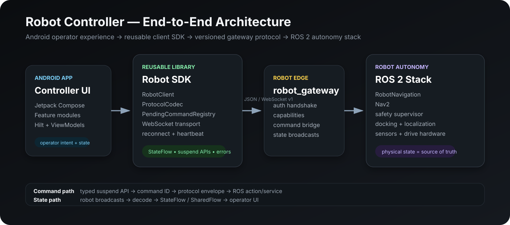
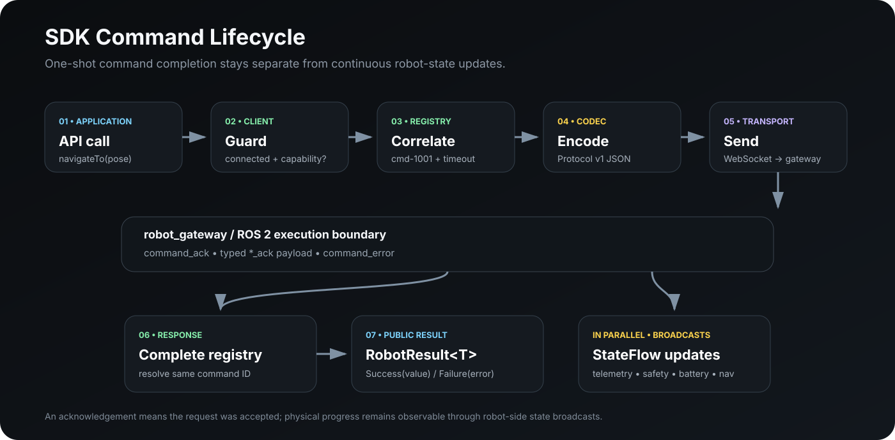
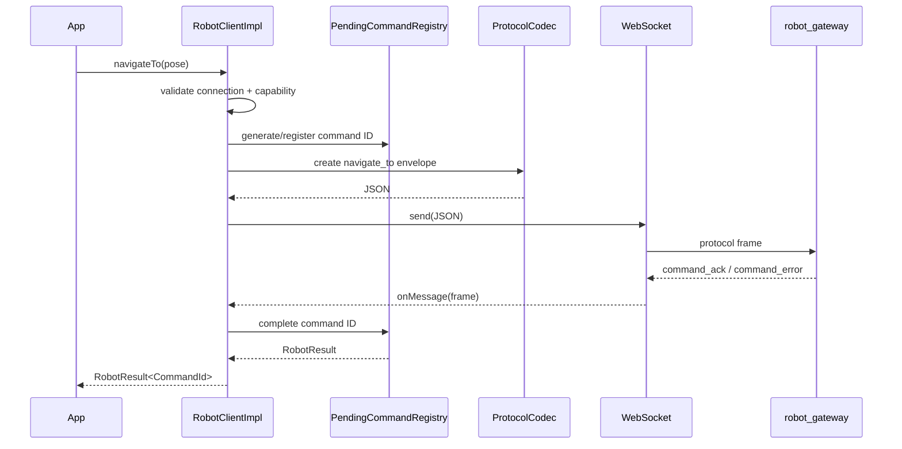
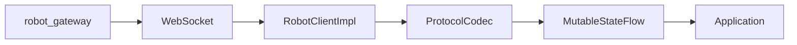
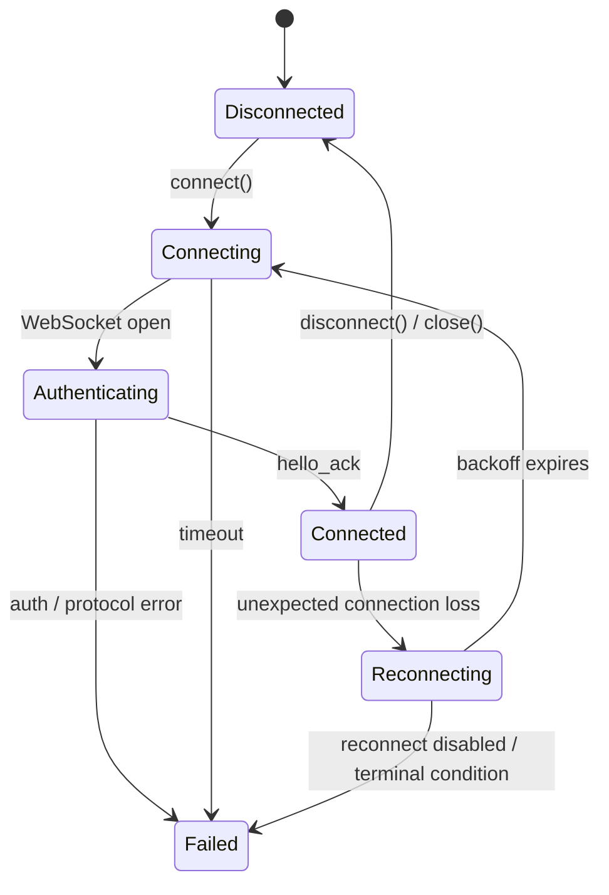

# Architecture Deep Dive

## 1. Architectural Goal

Robot Controller separates **robot-control semantics** from **Android application concerns**.

The reusable SDK is designed to be consumed without requiring:
- Hilt
- Room
- Jetpack Compose
- the controller application's navigation
- the controller application's feature modules

The controller application is therefore a consumer of the SDK rather than the owner of robot protocol logic.



---

## 2. Runtime Layers

### Layer A — Integrator / Controller UI

Typical consumers:
- controller application
- field-service application
- kiosk/tablet operator UI
- automated test harness
- future fleet application

Responsibilities:
- render state
- collect user intent
- choose when commands should be issued
- handle lifecycle and UI-level error presentation

The UI does not need to encode WebSocket JSON or ROS-specific transport details.

### Layer B — RobotClient public API

`RobotClient` is the main integration boundary.

It exposes:
- suspend functions for one-shot commands
- `StateFlow` for long-lived state
- `SharedFlow` for transient events

Long-lived state includes:
- connection state and metrics
- telemetry and telemetry freshness
- battery, docking, safety, and health
- active map and map operation state
- navigation state and mission progress
- robot configuration and robot information
- diagnostics

Commands cover:
- navigation
- manual velocity
- stop
- docking
- emergency stop
- map CRUD
- virtual-wall CRUD
- saved-location CRUD
- missions
- motion-limit updates
- log retrieval

### Layer C — RobotClientImpl orchestration

`RobotClientImpl` coordinates:
- transport
- protocol codec
- pending commands
- capability checks
- state reduction
- heartbeat
- telemetry freshness
- reconnect scheduling

It owns a `SupervisorJob` + IO coroutine scope so failure of one background task does not automatically terminate unrelated SDK work.

### Layer D — Protocol

`ProtocolCodec` converts between Kotlin domain objects and protocol envelopes.

Current protocol version:

```text
ROBOT_PROTOCOL_VERSION = 1
```

Protocol evolution is intentionally separated from Android application versioning.

### Layer E — Pending command registry

`PendingCommandRegistry` solves request/response correlation.

Each command:
1. receives a unique ID
2. registers a deferred result
3. is sent through transport
4. completes when a correlated acknowledgement/error arrives
5. fails with a structured timeout when no response arrives

The registry uses:
- `ConcurrentHashMap` for in-flight commands
- `AtomicLong` for command IDs
- `CompletableDeferred` for coroutine-friendly completion

### Layer F — WebSocket transport

`WebSocketRobotTransport` uses OkHttp.

Responsibilities:
- build `ws://` or `wss://` endpoint
- establish/close socket
- forward text frames
- report connection lifecycle to `RobotClientImpl`
- support custom TLS socket factory/trust manager hooks

The transport layer does not contain robot-domain behavior.

### Layer G — robot_gateway

Conceptually:

```text
Robot Protocol v1
      ↓
robot_gateway
      ↓
ROS 2 topics / services / actions
      ↓
RobotNavigation / Nav2 / safety / docking
```

This keeps ROS client libraries out of the Android SDK.

---

## 3. Command Path





**Important:** command acceptance and physical robot state are separate.

A successful `navigateTo()` means the gateway accepted the navigation request. Progress, arrival, or failure are subsequently represented by live navigation/telemetry state.

---

## 4. Broadcast State Path

Robot-side broadcasts are not correlated with a pending command.

Examples:
- `telemetry`
- `battery_state`
- `safety_state`
- `docking_state`
- `robot_health`
- `mission_progress`



This allows application screens to observe robot state independently of which component initiated a command.

---

## 5. Connection State Machine



Connected state includes:
- gateway version
- protocol version
- advertised capabilities
- session ID

This lets the SDK gate feature calls locally before sending unsupported commands.

---

## 6. Capability Negotiation

`RobotCapability` currently models 17 capabilities:

- NAVIGATION
- MANUAL_CONTROL
- DOCKING
- SAFETY
- TELEMETRY
- BATTERY
- HEALTH
- MAP_SWITCHING
- MAP_MANAGEMENT
- VIRTUAL_WALLS
- SAVED_LOCATIONS
- WAYPOINT_NAVIGATION
- MISSIONS
- ROBOT_CONFIGURATION
- ROBOT_DISCOVERY
- DIAGNOSTICS
- LOG_RETRIEVAL

If disconnected, the SDK returns `NOT_CONNECTED`.

If the gateway advertises capabilities and a requested feature is absent, the SDK returns `UNSUPPORTED_CAPABILITY` before network dispatch.

---

## 7. Reconnection & Data Freshness

Two reliability problems are modeled separately.

### Transport availability

Unexpected socket failure can transition into `Reconnecting`.

Backoff uses:
- initial delay
- maximum delay
- multiplier
- jitter ratio

Explicit user disconnect suppresses reconnect.

### Data freshness

A socket can be connected while physical telemetry is stale.

`TelemetryFreshness` records:
- stale/not stale
- age in milliseconds
- last receive time

This prevents applications from treating old physical state as current state.

---

## 8. Multi-Robot Architecture

`RobotManager` stores independent `RobotClient` instances in a `ConcurrentHashMap` keyed by robot ID.

Properties:
- clients are lazily created
- access is thread-safe
- removing a client closes it
- closing the manager closes every managed client

Each client retains its own:
- WebSocket
- pending command registry
- coroutine scope
- state flows
- reconnection state

---

## 9. Discovery

`RobotDiscoveryManager` listens for UDP discovery beacons.

Default discovery port:

```text
8088
```

Example beacon:

```json
{
  "type": "robot_discovery_beacon",
  "robotId": "robot-001",
  "name": "AMR 01",
  "host": "192.168.1.50",
  "port": 8080,
  "protocolVersion": 1
}
```

The implementation:
- ignores malformed packets
- de-duplicates robots by ID
- falls back to sender address when host is omitted
- executes on `Dispatchers.IO`

---

## 10. Controller App Module Topology


The controller application is built from:
- `:app`
- `:feature:home`
- `:feature:navigation`
- `:feature:manualcontrol`
- `:feature:map`
- `:feature:robotstatus`
- `:feature:settings`
- `:core:theme`
- `:core:database`
- `:core:networking`
- `:robot:sdk`

### Compatibility adapter

The current UI still consumes the deprecated `RobotRepository` interface.

`AppRobotModule` provides:

```text
RobotClient
   ↓
RobotClientRepositoryImpl
   ↓
RobotRepository (deprecated compatibility contract)
   ↓
Feature ViewModels
```

The adapter translates connection state, telemetry, battery, docking state, and high-level movement actions into the older UI contract.

This is a migration strategy: the SDK was rewritten without forcing every Compose feature to be rewritten in the same change.

New external consumers should use `RobotClient` directly.

---

## 11. State Ownership

| State | Owner |
|---|---|
| Socket connected? | SDK transport/client |
| Gateway capabilities | SDK client |
| In-flight command correlation | SDK registry |
| Robot pose/velocity | Robot-side stack, mirrored by SDK |
| Navigation progress | Robot-side stack, mirrored by SDK |
| Safety/docking/battery | Robot-side stack, mirrored by SDK |
| Selected app screen/tab | Controller UI |
| Form input/dialog visibility | Feature ViewModel/UI |
| Local persisted logs/data | App database layer |

This avoids dual sources of truth.

---

## 12. Failure Model

Public operations return:

```kotlin
sealed interface RobotResult<out T> {
    data class Success<T>(val value: T) : RobotResult<T>
    data class Failure(val error: RobotError) : RobotResult<Nothing>
}
```

A `RobotError` contains:
- stable error code
- subsystem
- severity
- human-readable message
- recoverability flag
- optional source code

SDK-originated errors include:
- CONNECT_TIMEOUT
- NOT_CONNECTED
- UNSUPPORTED_CAPABILITY
- SEND_FAILED
- COMMAND_TIMEOUT
- COMMAND_FAILED
- INVALID_ARGUMENT
- INVALID_GEOMETRY
- DECODE_ERROR
- TRANSPORT_ERROR
- CONNECTION_LOST

The gateway can also return robot-domain errors such as localization or safety failures.

---

## 13. Testability Boundary

The SDK ships integration-support test tools.

### FakeRobotClient
- implements the public client interface
- exposes mutable state backing its public flows
- can switch command success/failure behavior

### ProtocolSimulator
- produces deterministic protocol frames
- supports hello acknowledgement and telemetry generation

The `protocol-fixtures` directory provides JSON frames intended for validation by both sides of the protocol boundary.

This allows compatibility testing without a physical robot.

---

## 14. Design Decisions

### Why WebSocket instead of embedding ROS 2 in Android?

It keeps:
- ROS middleware off the Android dependency graph
- the SDK smaller and easier to consume
- the Android API robot-domain focused
- protocol compatibility explicitly versioned

### Why StateFlow?

Robot state changes continuously. `StateFlow` provides:
- a current value
- lifecycle-friendly collection
- direct ViewModel integration
- deterministic replacement in tests

### Why suspend command APIs?

Commands are asynchronous and require timeout/error correlation. Suspend functions express that without callback nesting.

### Why capability negotiation?

Robot stacks evolve at different speeds. Capabilities let an app degrade gracefully rather than assuming every gateway implements the same feature set.
