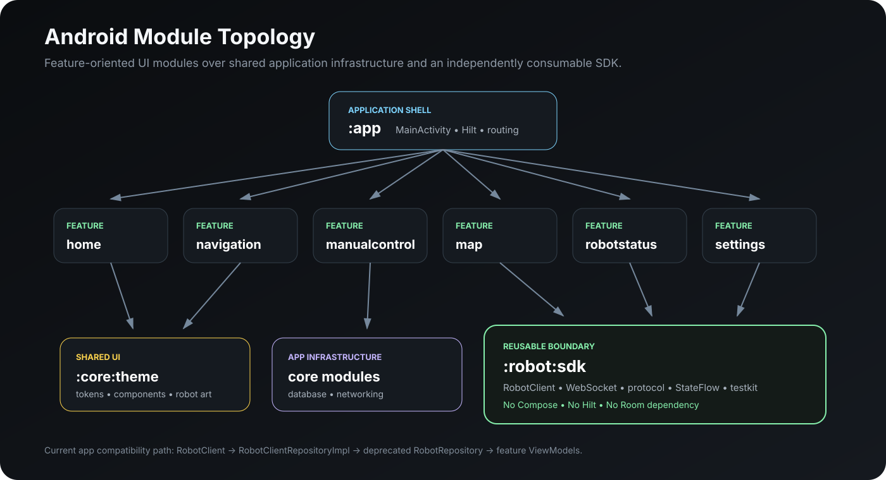
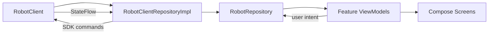

# Controller App Guide

The repository includes a real Android controller application in addition to the reusable SDK.

The app demonstrates how robot-domain state can be projected into a tablet/operator UI using:
- Jetpack Compose
- Hilt
- ViewModels
- StateFlow
- a shared monochrome design system
- modular Android feature boundaries



---

## 1. Application Shell

Entry point:

```text
app/src/main/java/com/alokrathava/robotcontroller/MainActivity.kt
```

`MainActivity`:
- installs AndroidX SplashScreen
- enables edge-to-edge rendering
- hosts the Compose UI
- switches between feature screens through sidebar state
- resolves feature ViewModels through Hilt

Top-level destinations:
- Home
- Navigation
- Manual Control
- Robot Status
- Maps
- Settings

The current shell uses direct in-memory destination selection instead of a navigation graph, which keeps the tablet dashboard interaction simple.

---

## 2. Dependency Injection Boundary

`AppRobotModule` provides one singleton `RobotClient`.

Current development endpoint in the app module:

```text
192.168.1.100:8080
```

The module also provides a compatibility implementation of the deprecated `RobotRepository`.



This preserves existing UI contracts while the reusable SDK evolves independently.

---

## 3. Home / Connection Experience

Module:

```text
:feature:home
```

The home feature has three screen phases:

```text
SPLASH → CONNECTION → DASHBOARD
```

### Splash
Provides the entry choice to connect/control.

### Connection
Separates:
- network selection
- IP/port configuration
- connection status

### Dashboard
Surfaces key robot information and actions such as:
- battery
- pose
- robot state
- navigation shortcut
- manual-control shortcut
- return-to-charge/dock
- navigation cancellation / safety-oriented action

The ViewModel combines repository flows into a single UI state so composables do not orchestrate robot data sources directly.

---

## 4. Navigation

Module:

```text
:feature:navigation
```

The navigation screen is map-centric.

Main areas:
- left map/floor-plan visualization
- destination/control panel
- execution-state banner
- coordinate/destination interaction
- add-location dialog

Execution UI distinguishes:
- navigating
- obstacle detected
- arrived
- failed

The screen also exposes navigation cancellation.

The current visual map preview is programmatically drawn with Compose Canvas, keeping the feature independent of a third-party map-rendering library.

---

## 5. Manual Control

Module:

```text
:feature:manualcontrol
```

The manual-control experience includes:
- Movement tab
- Rotation tab
- Telemetry tab
- Diagnostics tab
- directional controls
- joystick interaction
- speed control
- reconnect action
- emergency-brake state

Controls are disabled when:
- the robot is disconnected
- emergency stop is active

That is an important operator-safety UI property: movement input availability is derived from connection/safety state.

---

## 6. Map Management

Module:

```text
:feature:map
```

The map UI contains:
- map list
- selected-map preview
- active-map indicator
- add map dialog
- edit map name dialog
- delete confirmation dialog
- set-active action

The floor plan is rendered in `MapFloorPlanCanvas`, and the robot position can be overlaid when state is available.

At the SDK level, map support is broader than the older UI repository contract and now includes:
- list
- switch
- save current map
- rename
- delete
- virtual walls
- saved locations

The UI adapter can be migrated incrementally to those direct APIs.

---

## 7. Robot Status

Module:

```text
:feature:robotstatus
```

The status screen provides an at-a-glance operational dashboard.

Displayed metrics include:
- battery percentage
- estimated time remaining
- robot X/Y position
- yaw angle
- current robot state
- connection state/address
- speed
- temperature

The layout uses a robot illustration plus metric cards to separate robot identity from operational telemetry.

---

## 8. Settings

Module:

```text
:feature:settings
```

Settings tabs:
- Connection
- Navigation
- Robot
- Advanced

The connection tab implements:
- robot IP address
- port
- auto-connect toggle
- reconnection-attempt selection
- connection-timeout selection
- connection status
- latency
- last-connected information
- connect/disconnect action

The Navigation, Robot, and Advanced tabs currently act as extension points/placeholders rather than completed configuration surfaces.

---

## 9. Shared Design System

Module:

```text
:core:theme
```

The project uses a reusable monochrome UI system instead of styling every screen independently.

Shared components include:
- cards
- buttons
- text fields
- banners
- segmented controls
- switches
- sliders
- dialogs
- status pills
- spacing
- shapes
- typography
- semantic status colors

This reduces feature-level visual drift.

---

## 10. Local Persistence

Module:

```text
:core:database
```

The Room layer includes:
- `RobotDatabase`
- `RobotLogDao`
- `RobotLogEntity`
- Hilt database module

This database belongs to the application layer, not the reusable SDK.

That boundary is intentional: SDK consumers are not forced to adopt Room or this application's persistence choices.

---

## 11. Release Shrinking

The application enables release shrinking:

```kotlin
release {
    isMinifyEnabled = true
    isShrinkResources = true
}
```

Keep/consumer rules exist for:
- Hilt ViewModels
- Room
- Compose
- coroutines
- SDK public API
- serialized protocol payloads

A reusable SDK must continue to work in minified consumer applications, not only debug builds.

---

## 12. Migration Direction

Several feature ViewModels still consume `RobotRepository`, which is now deprecated.

Recommended long-term direction:

```text
Feature ViewModel
      ↓
RobotClient (or a narrow feature-domain wrapper)
      ↓
Robot SDK
```

The existing `RobotClientRepositoryImpl` should be treated as a compatibility adapter, not the preferred new integration API.

Some methods on the legacy repository adapter are still no-ops because the richer SDK functionality was added after the original UI contract. The documentation intentionally distinguishes this from the newer direct SDK surface.

---

## 13. UI Architecture Pattern

Across features, the dominant pattern is:

```text
Robot state / repository state
          ↓
       ViewModel
          ↓
        UiState
          ↓
    Compose screen
          ↓
     User callbacks
          ↓
       ViewModel
```

This keeps robot/network orchestration out of composables and makes previews/tests easier to construct.
