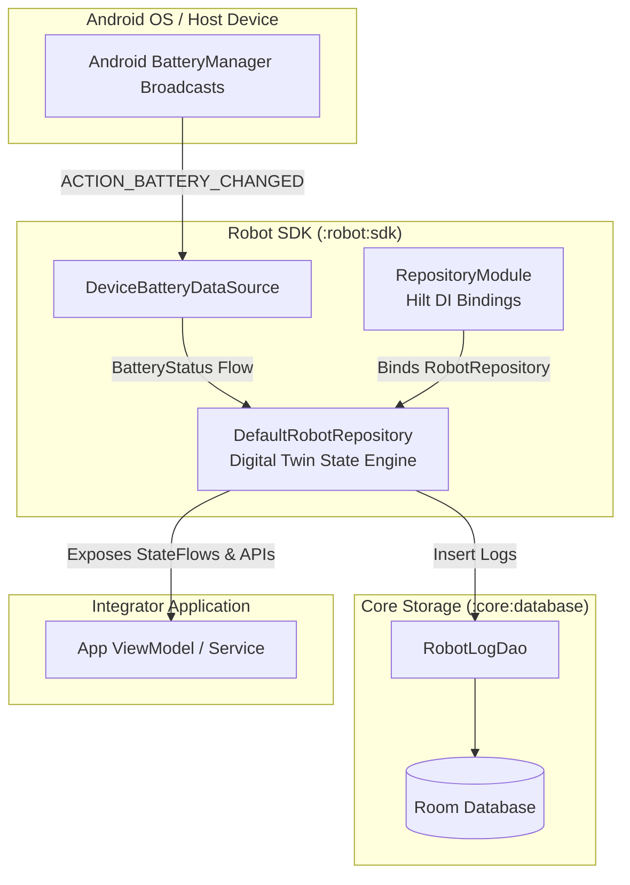
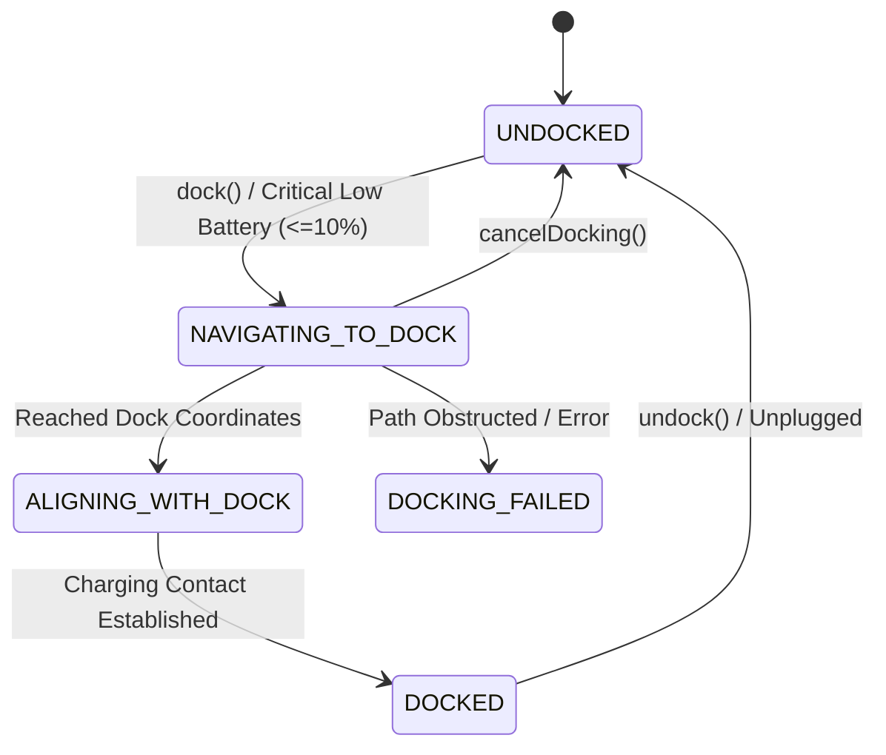
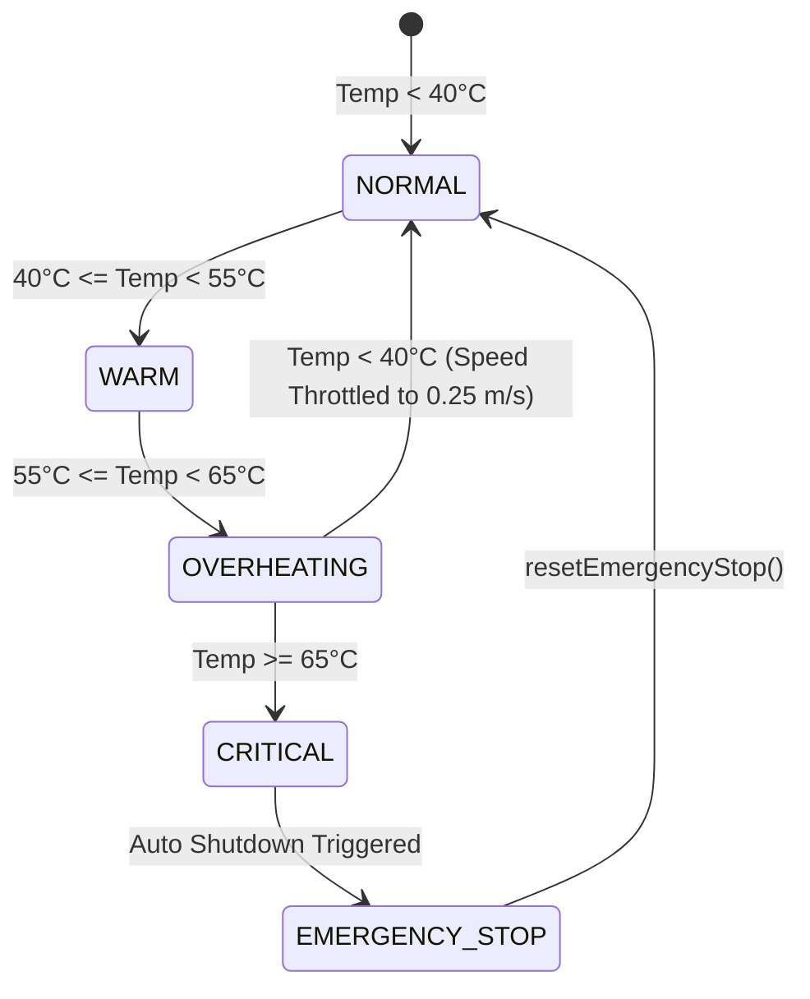

# Robot SDK & Digital Twin System Architecture Guide

The **Robot SDK** (`:robot:sdk`) provides a high-performance **Digital Twin** and hardware abstraction layer for Android-based mobile robot control systems. It encapsulates real-time battery status synchronization, 2D spatial navigation, autonomous docking state machines, thermal safety interlocks, Wi-Fi networking, and persistent audit logging.

---

## 1. System Architecture Document

### 1.1 High-Level Component Diagram



### 1.2 Core Components Breakdown

1. **`DeviceBatteryDataSource`**:
   - Registers system `IntentFilter(Intent.ACTION_BATTERY_CHANGED)` broadcast receiver with `@ApplicationContext Context`.
   - Parses battery percentage (`EXTRA_LEVEL` / `EXTRA_SCALE`), plugged charger type (`AC`, `USB`, `Wireless`), voltage in mV (`EXTRA_VOLTAGE`), temperature in °C (`EXTRA_TEMPERATURE`), and health status (`EXTRA_HEALTH`).
   - Emits real-time reactive `BatteryStatus` via Kotlin `callbackFlow`.

2. **`DefaultRobotRepository` (Digital Twin Controller)**:
   - Central state engine managing `StateFlow` reactive streams for battery, position, navigation, telemetry, docking, and connectivity.
   - Observes battery broadcasts to dynamically update thermal states and trigger low-battery auto-docking sequence.
   - Interlocks all motion and docking APIs against active `EMERGENCY_STOP` locks and thermal critical thresholds.

3. **`RobotLogDao` (`:core:database`)**:
   - Audits all state transitions, directional movements, docking events, Wi-Fi connections, and safety shutdowns into local SQLite storage.

4. **`RepositoryModule` (Hilt Dependency Injection)**:
   - Provides `@Binds` singleton binding mapping the `RobotRepository` interface to `DefaultRobotRepository`.

---

### 1.3 Digital Twin State Machines

#### Docking State Lifecycle


#### Thermal Telemetry & Safety States


---

## 2. Integrator Developer API Guide

### 2.1 Gradle Dependency Setup

To integrate `:robot:sdk` into a module within the same Gradle project:

```kotlin
// build.gradle.kts (App / Feature Module)
dependencies {
    implementation(project(":robot:sdk"))
    
    // Hilt Dependency Injection
    implementation(libs.hilt.android)
    ksp(libs.hilt.compiler)
}
```

---

### 2.2 Injecting `RobotRepository`

Inject the `RobotRepository` interface into your ViewModel or Service using Hilt:

```kotlin
package com.example.app

import androidx.lifecycle.ViewModel
import androidx.lifecycle.viewModelScope
import com.agrathava.sdk.RobotRepository
import com.agrathava.sdk.model.DirectionCommand
import dagger.hilt.android.lifecycle.HiltViewModel
import kotlinx.coroutines.flow.SharingStarted
import kotlinx.coroutines.flow.stateIn
import javax.inject.Inject

@HiltViewModel
class RobotControlViewModel @Inject constructor(
    private val robotRepository: RobotRepository
) : ViewModel() {

    // Expose SDK StateFlows to UI
    val batteryStatus = robotRepository.batteryStatus
    val robotPosition = robotRepository.position
    val navigationStatus = robotRepository.navigationStatus
    val dockingStatus = robotRepository.dockingStatus
    val telemetry = robotRepository.telemetry
    val connectionStatus = robotRepository.connectionStatus

    // Motion Commands
    fun moveForward() {
        robotRepository.move(DirectionCommand.FORWARD)
    }

    fun moveRight() {
        robotRepository.move(DirectionCommand.RIGHT)
    }

    fun stopOrEmergency() {
        robotRepository.triggerEmergencyStop()
    }

    fun clearEmergency() {
        robotRepository.resetEmergencyStop()
    }

    // Docking Commands
    fun startDocking() {
        robotRepository.dock()
    }

    fun undockRobot() {
        robotRepository.undock()
    }
}
```

---

### 2.3 Collecting State in Jetpack Compose

```kotlin
@Composable
fun RobotTelemetryCard(viewModel: RobotControlViewModel = hiltViewModel()) {
    val battery by viewModel.batteryStatus.collectAsState()
    val position by viewModel.robotPosition.collectAsState()
    val docking by viewModel.dockingStatus.collectAsState()
    val telemetry by viewModel.telemetry.collectAsState()

    Column(modifier = Modifier.padding(16.dp)) {
        Text(text = "Battery: ${battery.displayText} (${battery.voltageMv} mV, ${battery.temperatureCelsius}°C)")
        Text(text = "Position: (${position.displayText}) | Heading: ${position.headingDegrees}°")
        Text(text = "Docking Status: $docking")
        Text(text = "Speed: ${telemetry.speedMps} m/s | Thermal State: ${telemetry.thermalState}")

        if (telemetry.isEmergencyStopped) {
            Button(
                onClick = { viewModel.clearEmergency() },
                colors = ButtonDefaults.buttonColors(containerColor = MaterialTheme.colorScheme.error)
            ) {
                Text("RESET EMERGENCY STOP")
            }
        }
    }
}
```

---

### 2.4 Complete API Reference (`RobotRepository`)

| Category | API | Description |
| :--- | :--- | :--- |
| **Battery** | `val batteryStatus: StateFlow<BatteryStatus>` | Level percent, charging flag, plug type, voltage, temp, health, low-battery flag. |
| | `fun refreshBattery()` | Forces an immediate pull from system battery manager. |
| **Docking** | `val dockingStatus: StateFlow<DockingStatus>` | Current docking state (`UNDOCKED`, `NAVIGATING_TO_DOCK`, `ALIGNING_WITH_DOCK`, `DOCKED`, `DOCKING_FAILED`). |
| | `val dockStation: StateFlow<DockStation>` | Target charging dock details and position. |
| | `fun dock()` | Initiates autonomous docking sequence. |
| | `fun undock()` | Disengages from dock, moves away, and sets status to `UNDOCKED`. |
| | `fun cancelDocking()` | Aborts active docking navigation. |
| **Safety & Thermal** | `val telemetry: StateFlow<RobotTelemetry>` | Speed, obstacle distance, thermal state, emergency stop flag, docked flag. |
| | `fun triggerEmergencyStop()` | Immediate emergency stop lock halting all motors. |
| | `fun resetEmergencyStop()` | Resets emergency stop state to `IDLE`. |
| **Motion** | `val position: StateFlow<RobotPosition>` | Current (x, y) coordinates and heading angle in degrees. |
| | `val navigationStatus: StateFlow<NavigationStatus>` | Current status (`IDLE`, `NAVIGATING`, `CHARGING`, `CANCELLED`, `EMERGENCY_STOP`). |
| | `fun move(direction: DirectionCommand)` | Step movement (`FORWARD`, `BACKWARD`, `LEFT`, `RIGHT`). |
| | `fun moveToPosition(x: Double, y: Double)` | Point-to-point coordinate navigation. |
| **Networking** | `val connectionStatus: StateFlow<ConnectionStatus>` | Wi-Fi/socket connection status (`DISCONNECTED`, `CONNECTING`, `CONNECTED`, `FAILED`). |
| | `fun connectToRobot(ip: String, port: Int, ssid: String)` | Connects to robot hotspot/socket address. |
| | `fun disconnectRobot()` | Disconnects network session. |

---

## 3. Safety & Hardware Interlocks

1. **Emergency Stop Lockout**:
   - When `triggerEmergencyStop()` or thermal critical is active (`isEmergencyStopped = true`), all calls to `move()`, `moveToPosition()`, and `dock()` are **automatically rejected** and logged as `MOVE_REJECTED` / `DOCK_REJECTED`.
   - Normal operation resumes only after calling `resetEmergencyStop()`.

2. **Thermal Throttling & Protection**:
   - **OVERHEATING (>= 55°C)**: Movement speed is automatically capped to a max threshold of `0.25 m/s`.
   - **CRITICAL (>= 65°C)**: Triggers an automatic `EMERGENCY_STOP` to prevent hardware degradation.

3. **Critical Low Battery Auto-Docking**:
   - When battery level drops to **<= 10%** and the robot is `UNDOCKED` and not charging, the SDK automatically initiates `dock()`.

---

## 4. Building & Releasing the SDK AAR Binary

To package and export `:robot:sdk` as a standalone compiled **Android Archive (`.aar`)** release artifact for external distribution:

### 4.1 Build Command

Run the Gradle `assembleRelease` task:

```bash
./gradlew :robot:sdk:assembleRelease
```

### 4.2 Output Location

After a successful build, the compiled release AAR file is generated at:

```
robot/sdk/build/outputs/aar/sdk-release.aar
```

---

### 4.3 Consuming the `.aar` in an External Application

1. Copy `sdk-release.aar` into the target app's `libs/` folder (`app/libs/sdk-release.aar`).
2. Include the local AAR dependency in `app/build.gradle.kts`:

```kotlin
// app/build.gradle.kts
dependencies {
    implementation(files("libs/sdk-release.aar"))

    // Required Transitive Runtime Dependencies
    implementation("androidx.core:core-ktx:1.15.0")
    implementation("com.google.dagger:hilt-android:2.51.1")
    ksp("com.google.dagger:hilt-compiler:2.51.1")
    implementation("androidx.room:room-runtime:2.6.1")
    implementation("androidx.room:room-ktx:2.6.1")
}
```

---

## 5. Automated GitHub Actions CI/CD Release Pipeline

The repository includes an automated GitHub Actions pipeline (`.github/workflows/sdk-release.yml`) for continuous testing, compilation, and release binary publishing.

### 5.1 Pipeline Lifecycle & Triggers

- **Build & Test Job**: Triggered automatically on every push to `main` and on pull requests.
  1. Sets up JDK 17 environment.
  2. Executes unit test suite (`./gradlew :robot:sdk:testDebugUnitTest`).
  3. Compiles release AAR (`./gradlew :robot:sdk:assembleRelease`).
  4. Uploads the generated AAR binary as a workflow run artifact (`robot-sdk-release-aar`).

- **Automated GitHub Release**: Triggered automatically when a version tag is pushed (e.g. `v1.0.0`, `sdk-v1.0.0`).
  1. Creates a formal **GitHub Release** on the repository.
  2. Attaches `sdk-release.aar` directly as a downloadable release asset.

### 5.2 Creating a New SDK Release

To release a new version of the SDK binary:

```bash
git tag -a v1.0.0 -m "Release Robot SDK v1.0.0"
git push origin v1.0.0
```

External developers can then navigate to the repository's **Releases** page on GitHub and download `sdk-release.aar` directly.
